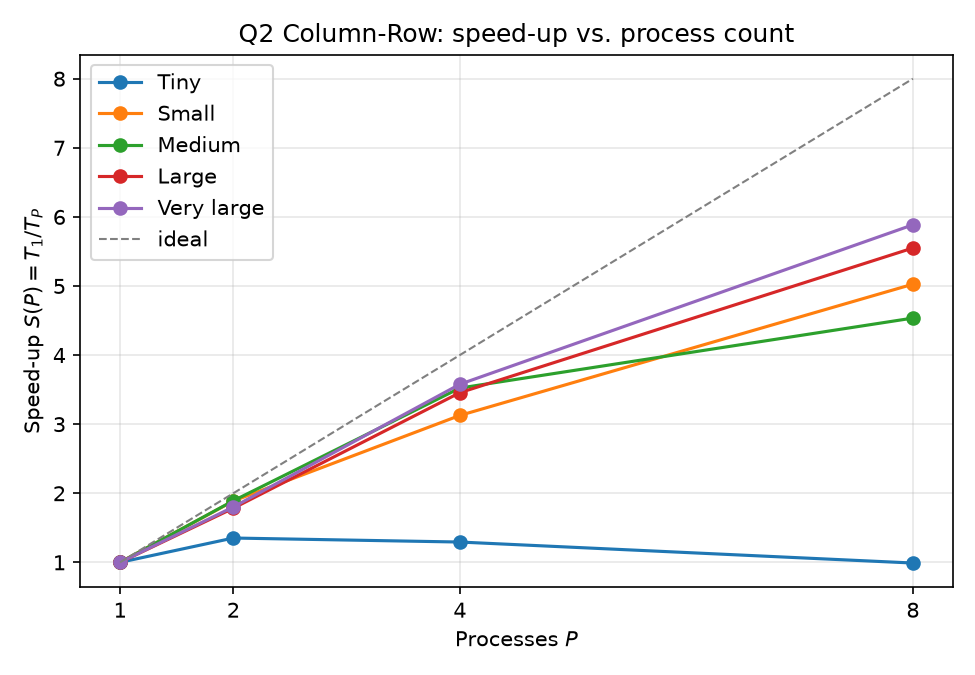
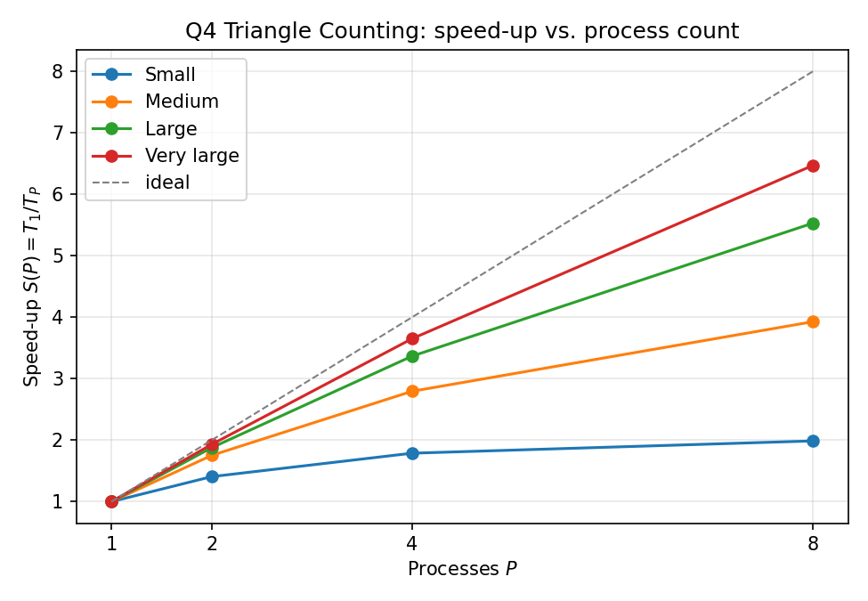
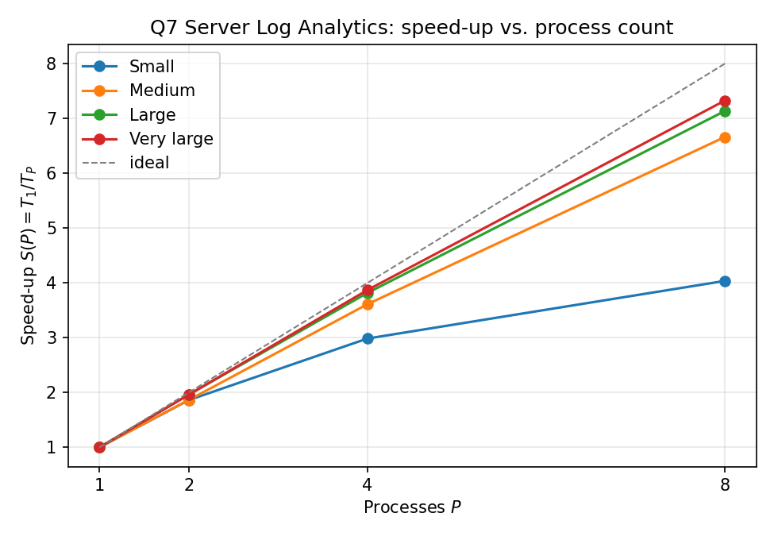

# Distributed Systems — Assignment 2

Q2 Column-Row Matrix Multiplication · Q4 Triangle Counting · Q7 Server Log Analytics

## Q2 — Column-Row Matrix Multiplication

### Method

We can write the product as a sum over the shared dimension `n`:

$$C = A \times B = \sum_{k=1}^{n} (\text{column } k \text{ of } A)(\text{row } k \text{ of } B)$$

Each term in that sum is a full `m × p` matrix. So we split the sum: every
process gets some of the `k` values, builds its own partial `m × p` answer,
and then one `MPI_Reduce` adds all the partial answers together on rank 0.

Two `MPI_Scatterv` calls send each process the columns of `A` and rows of `B`
it needs. The important point is that every process keeps a **full** `m × p`
result matrix, so the final reduce always sends `m × p` numbers, no matter how
many processes we use.

Sizes used: Tiny = 100×100 × 100×100, Small = 500×500 × 500×500,
Medium = 1000×1000 × 1000×1000, Large = 2000×2000 × 2000×2000,
Very large = 4000×4000 × 4000×4000.

### Speed-up $S(P) = T_1 / T_P$

| Input size | $P=1$ | $P=2$ | $P=4$ | $P=8$ |
|------------|:-----:|:-----:|:-----:|:-----:|
| Tiny | 1.00 | 1.35 | 1.29 | 0.99 |
| Small | 1.00 | 1.89 | 3.13 | 5.03 |
| Medium | 1.00 | 1.89 | 3.52 | 4.54 |
| Large | 1.00 | 1.78 | 3.46 | 5.55 |
| Very large | 1.00 | 1.80 | 3.58 | 5.89 |



### Runtime (seconds)

| Input size | $P=1$ | $P=2$ | $P=4$ | $P=8$ |
|------------|:-----:|:-----:|:-----:|:-----:|
| Tiny | 0.0006 | 0.0004 | 0.0005 | 0.0006 |
| Small | 0.0695 | 0.0368 | 0.0222 | 0.0138 |
| Medium | 0.5412 | 0.2861 | 0.1536 | 0.1193 |
| Large | 5.6950 | 3.1932 | 1.6480 | 1.0262 |
| Very large | 47.9148 | 26.5931 | 13.3929 | 8.1413 |

### Efficiency $E(P) = S(P)/P$

| Input size | $P=1$ | $P=2$ | $P=4$ | $P=8$ |
|------------|:-----:|:-----:|:-----:|:-----:|
| Tiny | 1.00 | 0.68 | 0.32 | 0.12 |
| Small | 1.00 | 0.94 | 0.78 | 0.63 |
| Medium | 1.00 | 0.95 | 0.88 | 0.57 |
| Large | 1.00 | 0.89 | 0.86 | 0.69 |
| Very large | 1.00 | 0.90 | 0.89 | 0.74 |

### Communication vs. computation

Time spent inside MPI calls (the two scatters plus the final reduce), as a
percentage of the run.

| Input size | $P=1$ | $P=2$ | $P=4$ | $P=8$ |
|------------|:-----:|:-----:|:-----:|:-----:|
| Tiny | 5.6% | 33.0% | 65.2% | 90.0% |
| Small | 1.3% | 5.8% | 20.5% | 33.3% |
| Medium | 0.5% | 2.0% | 7.7% | 15.2% |
| Large | 0.2% | 0.6% | 3.1% | 4.7% |
| Very large | 0.1% | 0.4% | 1.3% | 2.6% |

### Correctness

**52 checks, all passed**, each one at P = 1, 2, 4 and 8:

- Tested the two examples from the shared Assignment file, along with the three tricky cases: n = 1, m = 1, and p = 1. Each result was compared with a .expected file calculated by hand.
- Tested eight random matrix shapes and compared the results with matmul_seq, including a case where n is not divisible by P (100×63×80).

Full log: `Q2/results/correctness.txt`.

### Conclusion

- Speed-up gets better as the matrices get bigger: 5.03× at Small and 5.89×
  at Very large, on 8 processes.
- Tiny does not speed up at all (0.99×). The matrix is so small that 90% of
  the run is MPI calls at P = 8. It is kept in the report to show what happens
  when the problem is too small to divide.
- The reason it never reaches 8× is the final reduce. It always sends `m × p`
  numbers even when we add more processes, so its share of the run grows as
  the run gets shorter.
- Medium at P = 8 (0.57) is lower than expected. Its neighbours gained about
  1.6× going from P = 4 to P = 8 but Medium gained only 1.29×, so this is most
  likely one slow run on a shared machine, not a problem with the method.

\newpage

## Q4 — Triangle Counting in an Undirected Graph

### Method

First we sort the vertices by degree, using the vertex id to break ties. Then
we point every edge from the smaller vertex to the bigger one. If `N⁺(x)` means
"the vertices that `x` points to", then

$$\text{triangles} = \sum_{(u,v) \in E} |N^+(u) \cap N^+(v)|$$

This counts every triangle **exactly once**, so we do not have to divide by
three or halve anything at the end.

That is also what makes it safe in parallel. A triangle is only counted at one
particular edge, so if each process owns a different block of edges, two
processes can never count the same triangle. The counting needs no
communication at all — only one `MPI_Reduce` at the end to add the counts.

We sort by degree instead of by id because a popular vertex with a small id
would otherwise point to almost all of its neighbours, and its list would
become very long. Sorting by degree keeps every list around `√(2E)` long.

Sizes used: Small = 20,000 vertices and 250,000 edges, Medium = 10,000 and
500,000, Large = 6,000 and 750,000, Very large = 4,000 and 1,000,000.

### Speed-up $S(P) = T_1 / T_P$

| Input size | $P=1$ | $P=2$ | $P=4$ | $P=8$ |
|------------|:-----:|:-----:|:-----:|:-----:|
| Small | 1.00 | 1.41 | 1.79 | 1.99 |
| Medium | 1.00 | 1.75 | 2.80 | 3.93 |
| Large | 1.00 | 1.88 | 3.37 | 5.53 |
| Very large | 1.00 | 1.93 | 3.65 | 6.47 |



### Runtime (seconds)

| Input size | $P=1$ | $P=2$ | $P=4$ | $P=8$ |
|------------|:-----:|:-----:|:-----:|:-----:|
| Small | 0.0361 | 0.0257 | 0.0202 | 0.0182 |
| Medium | 0.1965 | 0.1121 | 0.0703 | 0.0500 |
| Large | 0.6779 | 0.3611 | 0.2013 | 0.1226 |
| Very large | 1.7782 | 0.9210 | 0.4870 | 0.2748 |

### Efficiency $E(P) = S(P)/P$

| Input size | $P=1$ | $P=2$ | $P=4$ | $P=8$ |
|------------|:-----:|:-----:|:-----:|:-----:|
| Small | 1.00 | 0.70 | 0.45 | 0.25 |
| Medium | 1.00 | 0.88 | 0.70 | 0.49 |
| Large | 1.00 | 0.94 | 0.84 | 0.69 |
| Very large | 1.00 | 0.97 | 0.91 | 0.81 |

### Communication vs. computation

Time spent inside MPI calls (broadcasting the edge list, plus the final reduce
of the counts), as a percentage of the run.

| Input size | $P=1$ | $P=2$ | $P=4$ | $P=8$ |
|------------|:-----:|:-----:|:-----:|:-----:|
| Small | 0.0% | 5.5% | 13.4% | 21.6% |
| Medium | 0.0% | 2.7% | 10.5% | 12.7% |
| Large | 0.0% | 1.3% | 4.8% | 5.9% |
| Very large | 0.0% | 0.6% | 2.5% | 4.0% |

### Correctness

**56 checks, all passed**, each one at P = 1, 2, 4 and 8:

- Tested the program with some graphs where we already know the expected answer:
  - One triangle
  - A path with no triangles
  - A star with no triangles
  - Two separate triangles
  - Complete graphs K4 and K5
- For K5, the expected number of triangles is C(5,3) = 10, which also helps catch double-counting errors.
- Tested the program on seven random graphs and compared the results with tri_seq.
- Also tested cases where E is not divisible by P.
- Tested K100, where the expected number of triangles is C(100,3) = 161,700.

- Graphs whose answer we know without a computer: the paper's example, one
  triangle, a path with none, a star with none, two separate triangles, and
  the complete graphs K4 and K5. K5 must give exactly C(5,3) = 10, so any
  double counting shows up straight away.
- Seven random graphs compared against `tri_seq`, including E not divisible
  by P, and K100 whose answer must be exactly C(100,3) = 161,700.

`tri_seq` uses a completely different method, so the two agreeing is real
proof and not a bug agreeing with itself. Full log:
`Q4/results/correctness.txt`.

### Conclusion

- Speed-up improves a lot with graph size: 1.99× on Small but 6.47× on Very
  large, at 8 processes. Efficiency goes from 0.25 to 0.81 in the same way.
- The counting phase itself scales almost perfectly. On Very large it went
  from 1.740 s to 0.222 s between P = 1 and P = 8, which is 7.9×.
- What holds it back is the build phase, where every process builds the same
  adjacency structure. That work is repeated P times instead of being shared,
  and it stays at about 0.02 s however many processes we use.
- On a small graph that fixed cost is a big share of a short run (34% at P = 8
  on Small); on a big graph it is a small share (10% on Very large). That is
  exactly why the efficiency column improves with size, and it is a simple
  example of Amdahl's law.

| Build as a share of the run | $P=1$ | $P=2$ | $P=4$ | $P=8$ |
|---|:-:|:-:|:-:|:-:|
| Small | 15.4% | 23.5% | 30.1% | 34.1% |
| Very large | 1.2% | 2.6% | 4.9% | 10.0% |

\newpage

## Q7 — Large-Scale Server Log Analytics

### Method

The log file is split by **bytes**, not by lines. Each process works out which
part of the file belongs to it, jumps straight there, and reads only that part.
If rank 0 read the whole file and sent pieces to everyone, rank 0 would become
the bottleneck and there would be no point in splitting the work.

A byte position usually lands in the middle of a line. So each process skips
forward to the start of the next full line, and at its own end it keeps reading
until the line it is in the middle of is finished. This way every line belongs
to exactly one process — nothing is lost and nothing is counted twice.

After that, each process counts its own part. One round of reductions merges
everything: `MPI_SUM` for the counters, bytes and status codes, `MPI_MIN` and
`MPI_MAX` for the fastest and slowest response, and element-wise `MPI_SUM` for
the per-server, per-endpoint and per-interval tables. Endpoint and interval ids
have no fixed upper limit, so one `MPI_Allreduce` first agrees on the range
before those tables are made.

Sizes used: Small = 10,000 log lines, Medium = 100,000, Large = 1,000,000,
Very large = 10,000,000. All use K = 10, 64 servers and 500 endpoints, so only
the amount of data changes.

### Speed-up $S(P) = T_1 / T_P$

| Input size | $P=1$ | $P=2$ | $P=4$ | $P=8$ |
|------------|:-----:|:-----:|:-----:|:-----:|
| Small | 1.00 | 1.86 | 2.99 | 4.04 |
| Medium | 1.00 | 1.86 | 3.61 | 6.66 |
| Large | 1.00 | 1.96 | 3.82 | 7.14 |
| Very large | 1.00 | 1.96 | 3.87 | 7.33 |



### Runtime (seconds)

| Input size | $P=1$ | $P=2$ | $P=4$ | $P=8$ |
|------------|:-----:|:-----:|:-----:|:-----:|
| Small | 0.0021 | 0.0011 | 0.0007 | 0.0005 |
| Medium | 0.0190 | 0.0102 | 0.0053 | 0.0029 |
| Large | 0.1799 | 0.0917 | 0.0471 | 0.0252 |
| Very large | 1.8028 | 0.9193 | 0.4658 | 0.2460 |

### Efficiency $E(P) = S(P)/P$

| Input size | $P=1$ | $P=2$ | $P=4$ | $P=8$ |
|------------|:-----:|:-----:|:-----:|:-----:|
| Small | 1.00 | 0.93 | 0.75 | 0.50 |
| Medium | 1.00 | 0.93 | 0.90 | 0.83 |
| Large | 1.00 | 0.98 | 0.95 | 0.89 |
| Very large | 1.00 | 0.98 | 0.97 | 0.92 |

### Communication vs. computation

Time spent inside MPI calls (the reductions that merge the counts), as a
percentage of the run. Reading the log is disk I/O, not communication, so it is
counted separately in the raw CSV.

| Input size | $P=1$ | $P=2$ | $P=4$ | $P=8$ |
|------------|:-----:|:-----:|:-----:|:-----:|
| Small | 0.1% | 2.4% | 9.8% | 17.9% |
| Medium | 0.0% | 0.8% | 3.4% | 5.4% |
| Large | 0.0% | 0.3% | 0.8% | 1.9% |
| Very large | 0.0% | 0.2% | 1.0% | 1.8% |

### Correctness

**44 checks, all passed**, each one at P = 1, 2, 4 and 8:

- Five small logs were checked by hand: the given example, all requests successful, all requests failed, a single-line log, and a case where the counts are tied, so the "smaller ID wins" rule is checked.
- Six generated logs were compared line by line with log_seq, including cases where N is not divisible by P, there are more servers than lines, and a 3-line log is run on 8 processes.

The clearest sign that the byte split is correct is that `TOTAL_REQUESTS`
always equals `N`. If a line were dropped or counted twice at a boundary, that
number would change immediately. Full log: `Q7/results/correctness.txt`.

### Conclusion

- This scales the best of the three: 7.33× on 8 processes, which is 92%
  efficiency.
- The reason is that the amount of data merged at the end does not grow with
  the log size. It is always a few hundred numbers, so the reduce stays under
  2% of the run on the two big sizes.
- Reading also gets faster with more processes, because each one reads its own
  slice at the same time. On Very large the read time went from 0.224 s at
  P = 1 to 0.036 s at P = 8, which is 6.3×.
- Efficiency is almost flat once the log is big enough (0.83 at 100,000 lines
  and 0.92 at 10,000,000). Only the smallest size drops (0.50), because the
  whole run there lasts about two milliseconds.

\newpage


### Handling sizes that do not divide evenly

None of the three programs needs a special case for a remainder, and each one
has a correctness test aimed at it.

| | How the work is split | What happens to the remainder | Test for it |
|---|---|---|---|
| Q2 | by the shared dimension `n` | the first `n mod P` processes take one extra pair; `MPI_Scatterv` accepts uneven counts | 100×63×80 at P = 4 and 8 |
| Q4 | by the edge list | the first `E mod P` processes take one extra edge | 2000 vertices, 4001 edges |
| Q7 | by byte position in the file | boundaries move forward to the next line start, and the last line is read past the end | 137 lines, and a 3-line log at P = 8 |

Q7 is the tricky one, because a byte split does not respect line boundaries at
all. Running a 3-line log on 8 processes leaves five processes with no work,
which is the strongest test of that fix.

## Overall conclusion

| | Best $S(8)$ | Efficiency at $P=8$ | What limits it |
|---|:-:|:-:|---|
| Q2 Column-Row | 5.89× | 0.74 | the `m × p` reduce, which does not shrink when P grows |
| Q4 Triangle counting | 6.47× | 0.81 | the adjacency build, repeated on every process |
| Q7 Log analytics | 7.33× | 0.92 | nothing major — closest to linear |

All three programs get faster with more processes, and all three scale better
as the input gets bigger. The difference between them is simply how much work
is **not** divided:

- **Q7** divides everything, even reading the file, and the final merge is
  always small. So it comes closest to the ideal line.
- **Q4** divides the counting perfectly, but every process repeats the same
  build step. That repeated part is small on a big graph and large on a small
  one, which is why efficiency goes from 0.25 up to 0.81.
- **Q2** divides the arithmetic perfectly, but always merges `m × p` numbers.
  As P grows the run gets shorter while that merge does not, so its share
  grows.

The smallest input of each question shows the same lesson three times: Q2 Tiny
at 0.99×, Q4 Small at 1.99×, Q7 Small at 4.04×. Using more processes only helps
when there is enough work to cover the fixed costs.

\newpage


## Setup

| | |
|---|---|
| Compiler | `mpicxx` / `g++`, OpenMPI 4.1.5 |
| Compile flags | `-O2 -std=c++17 -Wall` |
| Partition | `debug`, `--nodes=1 --ntasks=8 --cpus-per-task=1` |
| Core binding | `--hint=nomultithread`, `mpirun --bind-to core` |
| Repeats | 3 per measurement, fastest kept |
| Process counts | P = 1, 2, 4, 8 |

## How to run

```bash
cd Q2      # or Q4, Q7
module purge && module load openmpi/4.1.5
make                                  # build
make test                             # correctness at P = 1,2,4,8
make cbench                           # get cores, run the timing sweep, release
```

`make submit` hands the whole job to SLURM instead. To run one file at
P = 1, 2, 4 and 8 and print the answer with all four metrics:

```bash
make eval INPUT=input.txt             # Q2
make eval GRAPH=graph.txt             # Q4
make eval LOG=server_log.txt          # Q7
```

Each question folder has its own `README.md` with the full details.
